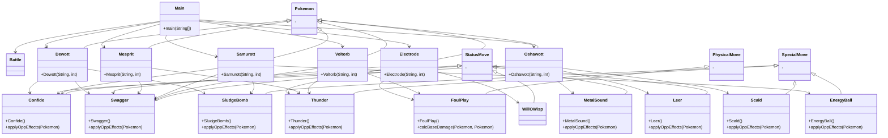

```mermaid


classDiagram

class Main {
    +main(String[])
}
Main --> Battle
Main --> Dewott
Main --> Electrode
Main --> Mesprit
Main --> Oshawott
Main --> Samurott
Main --> Voltorb

class Pokemon {
  -
}
class Dewott {
    +Dewott(String, int)
}
class Electrode {
    +Electrode(String, int)
}
class Mesprit {
    +Mesprit(String, int)
}
class Oshawott {
    +Oshawott(String, int)
}
class Samurott {
    +Samurott(String, int)
}
class Voltorb {
    +Voltorb(String, int)
}

Pokemon <|-- Dewott
Pokemon <|-- Electrode
Pokemon <|-- Mesprit
Pokemon <|-- Oshawott
Pokemon <|-- Samurott
Pokemon <|-- Voltorb

Dewott --> Confide
Dewott --> Swagger
Dewott --> SludgeBomb

Electrode --> Thunder
Electrode --> Swagger
Electrode --> FoulPlay
Electrode --> WillOWisp

Mesprit --> Thunder
Mesprit --> Swagger

Oshawott --> MetalSound
Oshawott --> Leer
Oshawott --> Confide
Oshawott --> Scald

Samurott --> Confide
Samurott --> Swagger
Samurott --> SludgeBomb
Samurott --> EnergyBall

Voltorb --> Thunder
Voltorb --> Swagger
Voltorb --> FoulPlay

class StatusMove {
    -
}
class SpecialMove {
    -
}
class PhysicalMove {
    -
}
class Thunder {
    +Thunder()
    +applyOppEffects(Pokemon)
}
class Swagger {
    +Swagger()
    +applyOppEffects(Pokemon)
}
class SludgeBomb {
    +SludgeBomb()
    +applyOppEffects(Pokemon)
}
class Scald {
    +Scald()
    +applyOppEffects(Pokemon)
}
class MetalSound {
    +MetalSound()
    +applyOppEffects(Pokemon)
}
class Leer {
    +Leer()
    +applyOppEffects(Pokemon)
}
class FoulPlay {
    +FoulPlay()
    +calcBaseDamage(Pokemon, Pokemon)
}
class EnergyBall {
    +EnergyBall()
    +applyOppEffects(Pokemon)
}
class Confide {
    +Confide()
    +applyOppEffects(Pokemon)
}

StatusMove <|-- WillOWisp
SpecialMove <|-- Thunder
StatusMove <|-- Swagger
SpecialMove <|-- SludgeBomb
SpecialMove <|-- Scald
StatusMove <|-- MetalSound
StatusMove <|-- Leer
PhysicalMove <|-- FoulPlay
SpecialMove <|-- EnergyBall
StatusMove <|-- Confide

```
